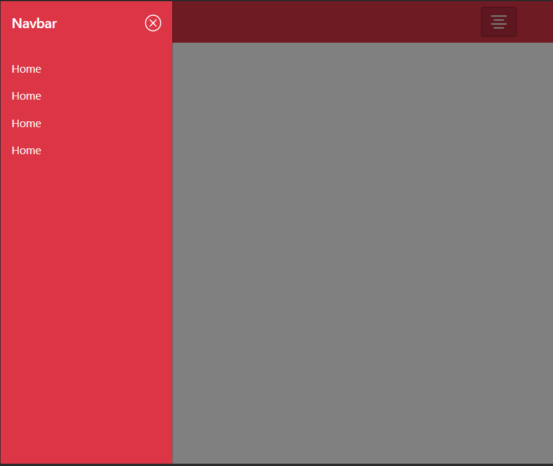

# Bootstrap-5-offcanvas-navbar-menu

Önceden soldan açılan menü için birçok css kodu yazman gerekiyordu. Şimdi ise Bootstrap 5 ile gelen offcanvas ile navbar menüyü birleştirdim. Tasarım pek hoş olmadı ama ekstra css kodu yazmadan yapmaya çalıştım. Anca bu kadar oldu. 😁 

